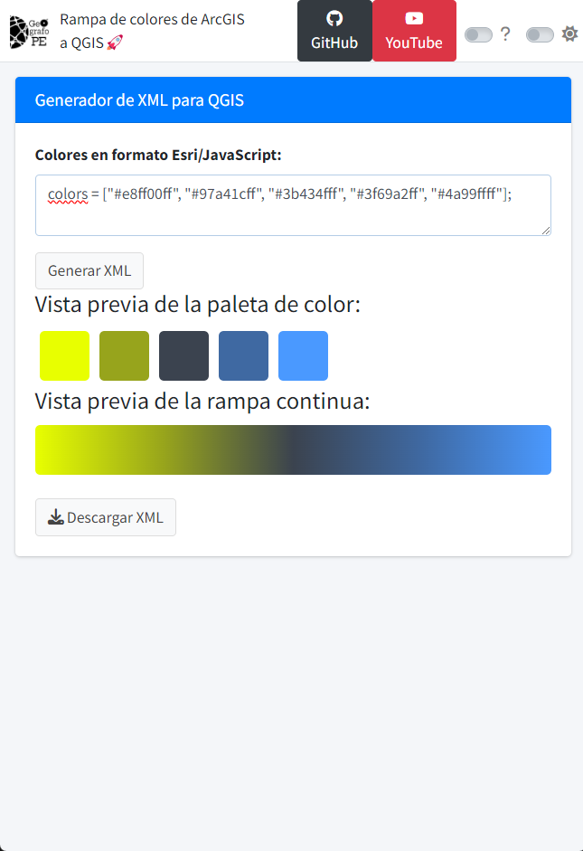

En este 📂 repositorio encontrarás una 📜 guía paso a paso para importar las paletas de colores de #ArcGIS a #QGIS de manera rápida y sencilla. 🚀 ¿Te gustaría aprovechar las increíbles rampas de colores de ArcGIS en tus proyectos de QGIS? ¡Ahora es posible!

Para ello utilizaremos una aplicación desarrollada con Shiny en R que simplifica el proceso, haciéndolo accesible incluso para usuarios sin experiencia en programación. 🌈

## ⚫ Pasos a realizar 
1. Primer paso: Entrar la página oficial de `ESRI` donde está alojado las paletas de color [(Link)](https://developers.arcgis.com/javascript/latest/visualization/symbols-color-ramps/esri-color-ramps/#ramps).
2. Segundo paso: Generar el xml de la paleta de color elegida con la aplicación de Shiny.
3. Tercer paso: Import el xml a `QGIS`.
4. Cuarto paso: Visualizar el resultado de nuestro entorno.

Todo el proceso desarrollado esta explicado al detalle en el siguiente video de YouTube 🎥.

¡Enteráte más y aprender conmigo! 🔍💡 Suscríbete, activa las notificaciones 🔔 y únete a la comunidad que ama el software libre de código abierto. 🌟🌍 👇
- https://www.youtube.com/@geografope

- https://www.tiktok.com/@geografope

- https://www.linkedin.com/in/antonybarja/

## ⚫ Referencias:
 - https://developers.arcgis.com/javascript/latest/visualization/symbols-color-ramps/esri-color-ramps/#ramps
  
